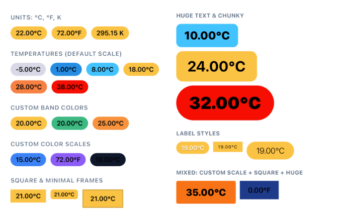

# react-native-temperature-badge

A cross-platform temperature badge component for React Native and web. Display temperature values in a color-coded pill/badge, with support for Celsius, Fahrenheit, and Kelvin. Built with React Native’s `Pressable` and `Text` for full accessibility and theming.



## Features

➡️ **Units:** Celsius (°C), Fahrenheit (°F), and Kelvin (K)
➡️ **Conversion:** Imperative `Temperature.convert()` for converting between units
➡️ **Color scale:** Default 6-band scale (very cold → hot); override specific bands or provide a custom scale
➡️ **Composable:** `TemperatureProvider`, `TemperatureFrame`, and `TemperatureLabel` for flexible layout
➡️ **Accessible:** Sensible `accessibilityLabel`s; `TemperatureFrame` forwards `Pressable` props
➡️ **Cross-platform:** React Native (iOS, Android) and web

---

## Installation

```sh
npm install react-native-temperature-badge
```

or with Yarn:

```sh
yarn add react-native-temperature-badge
```

### Peer dependencies

- `react` (any version)
- `react-native` (any version)

---

## Usage

### Basic badge

Wrap your badge in `TemperatureProvider` with the temperature `value` and `display` unit. Use `TemperatureFrame` for the colored pill and `TemperatureLabel` for the numeric text.

```tsx
import {
  TemperatureProvider,
  TemperatureFrame,
  TemperatureLabel,
} from 'react-native-temperature-badge';

function WeatherBadge() {
  return (
    <TemperatureProvider value={22} display="celsius">
      <TemperatureFrame>
        <TemperatureLabel />
      </TemperatureFrame>
    </TemperatureProvider>
  );
}
```

This renders a pill with a color from the default scale (e.g. green for ~22 °C) and the label `22.00 °C`.

### Converting from other units

If your data is in another unit, use `Temperature.convert()` before passing it to `TemperatureProvider`:

```tsx
import {
  Temperature,
  TemperatureProvider,
  TemperatureFrame,
  TemperatureLabel,
} from 'react-native-temperature-badge';

const tempF = 72;

<TemperatureProvider
  value={Temperature.convert(tempF, { from: 'fahrenheit', to: 'celsius' })}
  display="celsius"
>
  <TemperatureFrame>
    <TemperatureLabel />
  </TemperatureFrame>
</TemperatureProvider>
```

Or display in the same unit as your source:

```tsx
<TemperatureProvider value={tempF} display="fahrenheit">
  <TemperatureFrame>
    <TemperatureLabel />
  </TemperatureFrame>
</TemperatureProvider>
```

### Making the frame pressable

`TemperatureFrame` is a `Pressable`. Pass `onPress` and other `Pressable` props:

```tsx
<TemperatureProvider value={18} display="celsius">
  <TemperatureFrame onPress={() => console.log('Tapped')}>
    <TemperatureLabel />
  </TemperatureFrame>
</TemperatureProvider>
```

### Styling

`TemperatureFrame` and `TemperatureLabel` accept `style` (and other `Pressable`/`Text` props). `TemperatureFrame`’s `style` can be an array or a function `(state) => Style` for `Pressable`’s pressed/focused/hovered state.

```tsx
<TemperatureFrame style={{ marginTop: 8 }}>
  <TemperatureLabel style={{ color: '#1e293b' }} />
</TemperatureFrame>
```

---

## API

### `Temperature.convert(value, options)`

Convert a numeric temperature between units.

| Parameter   | Type           | Description                          |
|------------|----------------|--------------------------------------|
| `value`    | `number`       | Temperature in the `from` unit       |
| `options`  | `ConvertOptions` | `{ from: TemperatureUnit; to: TemperatureUnit }` |

**Returns:** `number` — temperature in the `to` unit.

**Example:**

```ts
Temperature.convert(32, { from: 'fahrenheit', to: 'celsius' });   // 0
Temperature.convert(273.15, { from: 'kelvin', to: 'celsius' });   // 0
Temperature.convert(100, { from: 'celsius', to: 'fahrenheit' });  // 212
```

Throws `RangeError` if the result would be negative Kelvin.

---

### `TemperatureProvider`

Provides the temperature value, unit, and color scale to `TemperatureFrame` and `TemperatureLabel`. Required as an ancestor of both.

| Prop         | Type                     | Required | Description |
|-------------|--------------------------|----------|-------------|
| `value`     | `number`                 | Yes      | Temperature in the unit given by `display`. Use `Temperature.convert()` if your source is in another unit. |
| `display`   | `'celsius' \| 'fahrenheit' \| 'kelvin'` | Yes | Unit of `value` and the unit shown in `TemperatureLabel`. |
| `colors`    | `Partial<Record<DefaultScaleBand, string>>` | No | Override colours for specific bands of the default scale. Ignored if `colorScale` is set. |
| `colorScale`| `ColorScaleEntryInput[]`  | No       | Full custom scale. Each entry: `{ celsius | fahrenheit | kelvin: number; color: string }`. When set, `colors` is ignored. |
| `children`  | `ReactNode`              | Yes      | Typically `TemperatureFrame` and `TemperatureLabel`. |

**Default scale bands** (`DefaultScaleBand`): `'veryCold' | 'cold' | 'cool' | 'mild' | 'warm' | 'hot'`.

**Override a few bands:**

```tsx
<TemperatureProvider
  value={-5}
  display="celsius"
  colors={{ veryCold: '#1e3a5f', hot: '#dc2626' }}
>
  <TemperatureFrame><TemperatureLabel /></TemperatureFrame>
</TemperatureProvider>
```

**Custom scale (e.g. Celsius):**

```tsx
<TemperatureProvider
  value={35}
  display="celsius"
  colorScale={[
    { celsius: -20, color: '#1e3a5f' },
    { celsius: 0, color: '#7dd3fc' },
    { celsius: 15, color: '#a7f3d0' },
    { celsius: 30, color: '#fcd34d' },
    { celsius: 45, color: '#dc2626' },
  ]}
>
  <TemperatureFrame><TemperatureLabel /></TemperatureFrame>
</TemperatureProvider>
```

---

### `TemperatureFrame`

A `Pressable` that renders a pill-shaped container. Background color is chosen from the `TemperatureProvider`’s color scale based on the current temperature. Must be used inside `TemperatureProvider`.

| Props | Type | Description |
|-------|------|-------------|
| `children` | `ReactNode` | Usually `TemperatureLabel`. |
| `style` | `StyleProp<ViewStyle>` or `(state: { pressed, hovered, focused }) => StyleProp<ViewStyle>` | Merged with the default pill style. |
| `accessible` | `boolean` | Default `true`. |
| `accessibilityLabel` | `string` | Default: e.g. `"22.00 degrees Celsius"`. |
| …all other `Pressable` props | | e.g. `onPress`, `onLongPress`, `disabled`. |

Default pill style: `paddingHorizontal: 12`, `paddingVertical: 6`, `borderRadius: 999`, `alignSelf: 'flex-start'`, and the computed `backgroundColor`.

---

### `TemperatureLabel`

A `Text` that shows the temperature and unit (e.g. `22.00 °C`). Must be used inside `TemperatureProvider`. Accepts all `Text` props except `children` (the label is derived from context).

| Props | Type | Description |
|-------|------|-------------|
| `style` | `StyleProp<TextStyle>` | Merged with default `fontSize: 15`, `fontWeight: '600'`. |
| `accessibilityLabel` | `string` | Override if needed. |
| …all other `Text` props | | |

Format: `{displayValue.toFixed(2)}{unitSymbol}` (e.g. `°C`, `°F`, ` K`).

---

## Exported types

- **`TemperatureUnit`** — `'fahrenheit' | 'kelvin' | 'celsius'`
- **`ConvertOptions`** — `{ from: TemperatureUnit; to: TemperatureUnit }`
- **`DefaultScaleBand`** — `'veryCold' | 'cold' | 'cool' | 'mild' | 'warm' | 'hot'`
- **`ColorScaleEntryInput`** — `{ celsius: number; color: string } | { fahrenheit: number; color: string } | { kelvin: number; color: string }`

---

## Default color scale

`DEFAULT_TEMPERATURE_COLOR_SCALE` is exported for reference or to base custom scales on. It is an array of `{ kelvin: number; color: string }` with 6 steps from very cold to hot (e.g. slate/blue for cold, green for mild, yellow/red for warm/hot). `TemperatureProvider` uses this when neither `colors` nor `colorScale` is provided.

---

## Contributing

- [Development workflow](CONTRIBUTING.md#development-workflow)
- [Sending a pull request](CONTRIBUTING.md#sending-a-pull-request)
- [Code of conduct](CODE_OF_CONDUCT.md)

## License

MIT

---

Made with [create-react-native-library](https://github.com/callstack/react-native-builder-bob)
